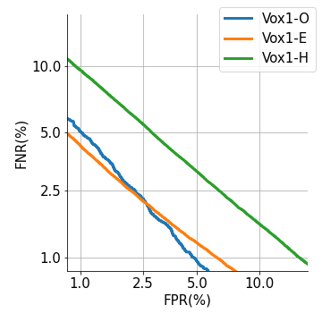

# Y-vector

## Y-vector: Multiscale Waveform Encoder for Speaker Embedding (Incomplete)

## Introduction
In this paper, we use the modular architecture on raw waveform speaker embedding, to be specific: a waveform encoder and deep embedding backbone. 

Official inference code for Y-vector (https://arxiv.org/abs/2010.12951) and unofficial code for wav2spk (https://www.isca-speech.org/archive/Interspeech_2020/pdfs/1287.pdf)

In our experiment, we train on VoxCeleb2 Dev dataset, and test on VoxCeleb1 dataset. 

Provided pretrained model ([link](https://drive.google.com/file/d/1aTfbJ8vBiuMYKZeEuGPF3hsYGJ_rYwoE/view?usp=sharing)) results (EER, minDCF(0.01)): 

| Metric        |VoxCeleb1-O  | VoxCeleb1-E  |VoxCeleb1-H | 
|------------------|------------------|------------------|------------------|
| EER      | 2.35            | 2.32              | 3.89             |
| minDCF(0.01)       | 0.242              |  0.235            | 0.349           |

## Requirements
python==3.6\
pytorch==1.7.1\
numba==0.48 # install before librosa\
librosa==0.6.3\
tqdm\
pandas

## Usage

This code is only for demonstration purpose, although many variables are hard-coded, the results can be ensured and reproduced.

After installed required packages, download VoxCeleb1 data first then use extract_wav.py to save input feature into pickle files. To inference embeddings for other datasets (minimum length of input utterance should be longer than 4 seconds) , pay attention to the saved pkl files before running extract_wav.py (pkl filename format: "spkid-recid-fileid.pkl", recording id is optional). Remember to replace the hard-coded file path in extract_wav.py and inference.py

Then run inference.py to compute embeddings and test EER and minDCF.

## Results 

Cosine similarity score results on VoxCeleb-1 Test dataset (EER):

| System         |VoxCeleb1-O[^1]  | VoxCeleb1-E  |VoxCeleb1-H | 
|------------------|------------------|------------------|------------------|
| wav2spk       | 3.00             | 2.78              | 4.56             |
| Y-vector.       | 2.72              |   2.38            | 3.87             |

([^1]Notice that VoxCeleb1-O can fluctuate a lot in our experimental setting)

It's possible to boost the performance by replacing each part with stronger networks. For example, replace backbone with F-TDNN, E-TDNN or ECAPA-TDNN.

